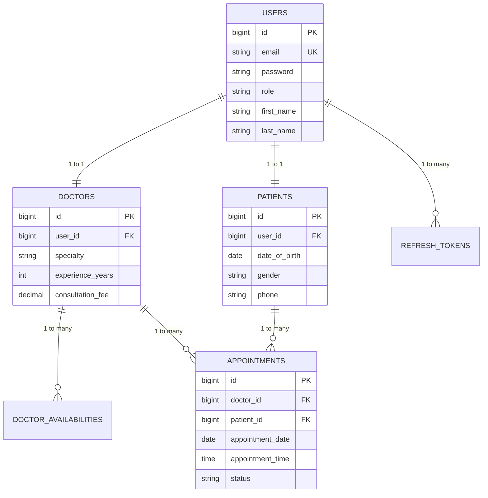
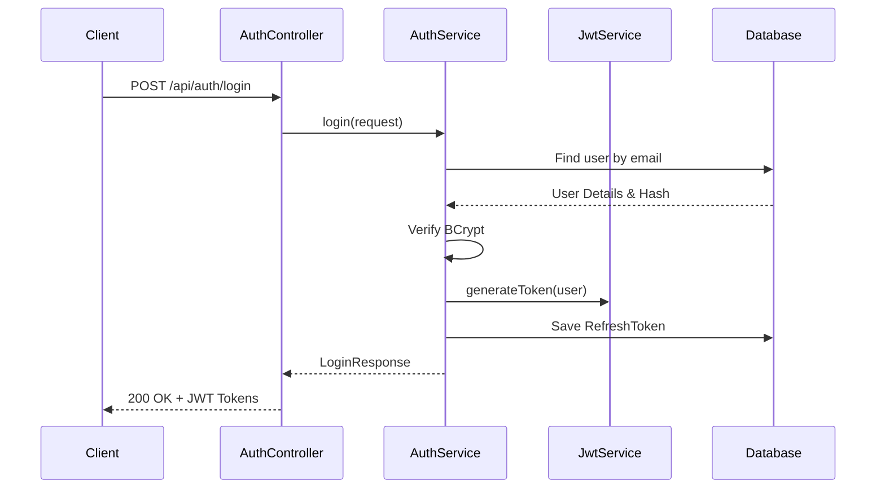
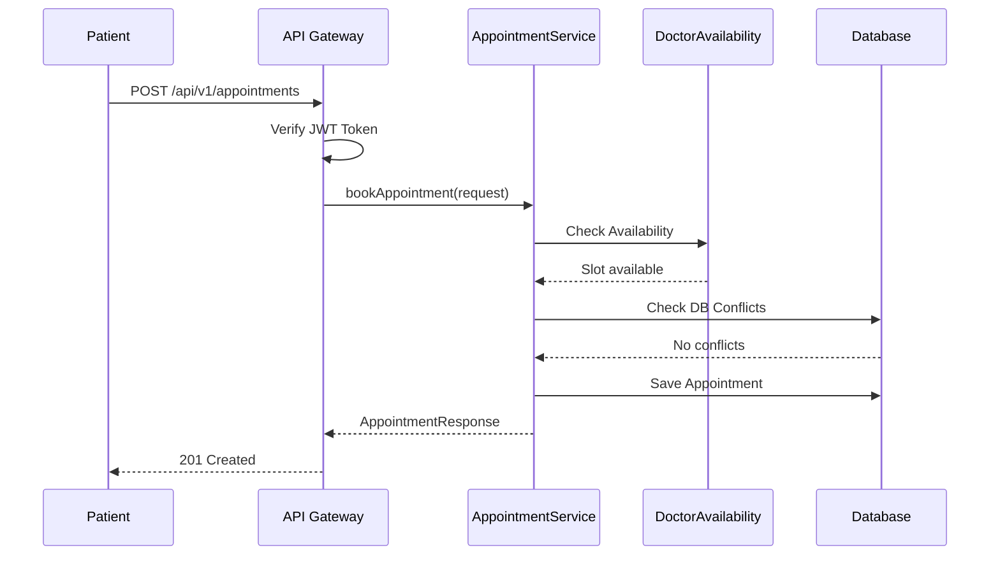

# Doctor Appointment Management System

An Enterprise-grade Healthcare Appointment Booking and Management API built with Java 17, Spring Boot 3, and MySQL.


---

## 📑 Table of Contents
- [Project Overview](#-project-overview)
- [Features](#-features)
- [Tech Stack](#-tech-stack)
- [System Architecture](#-system-architecture)
- [Folder Structure](#-folder-structure)
- [Installation Guide](#-installation-guide)
- [Docker Setup](#-docker-setup)
- [CI/CD Workflow](#-cicd-workflow)
- [Future Enhancements](#-future-enhancements)
- [Author Information](#-author-information)

---

## 🚀 Project Overview

The Doctor Appointment Management System is a robust backend API designed to facilitate seamless interactions between Patients and Doctors. It allows doctors to manage their availability schedules and enables patients to book, view, and cancel appointments securely. The architecture follows strict Clean Architecture and SOLID principles, ensuring the codebase is scalable, maintainable, and highly testable.

---

## ✨ Features

- **Robust Security**: Stateless JWT-based authentication with Access & Refresh tokens.
- **Role-Based Access Control**: Granular endpoint protection for `ADMIN`, `DOCTOR`, and `PATIENT` roles.
- **Profile Management**: Detailed profiles for doctors (specialties, fees) and patients (medical info).
- **Availability Scheduling**: Doctors can set weekly recurring time slots.
- **Conflict Prevention**: Database-level composite unique constraints prevent double-booking.
- **Global Error Handling**: Standardized, predictable JSON error responses across all APIs.
- **API Documentation**: Auto-generated interactive Swagger UI.
- **Database Versioning**: Flyway migrations ensure reproducible schemas across environments.
- **Production Ready**: Multi-stage Dockerfile with non-root security and JVM memory optimizations.

---

## 🛠️ Tech Stack

- **Core**: Java 17, Spring Boot 3.3.0
- **Data Access**: Spring Data JPA, Hibernate
- **Database**: MySQL 8.0, Flyway
- **Security**: Spring Security 6, JJWT (JSON Web Tokens)
- **Validation**: Jakarta Bean Validation
- **Documentation**: Springdoc OpenAPI (Swagger 3)
- **Testing**: JUnit 5, Mockito, MockMvc, Spring Boot Test
- **DevOps**: Docker, Docker Compose, GitHub Actions, Render IaC

---

## 🏛️ System Architecture

Please refer to the complete architecture breakdown in [docs/Architecture.md](docs/Architecture.md).

### 1. Database ER Diagram


### 2. Authentication Flow


### 3. Appointment Booking Flow


---

## 📁 Folder Structure

```text
src/main/java/com/healthcare/appointment/
├── config/         # App-wide configurations (OpenAPI, etc.)
├── controller/     # REST API Endpoints (No business logic)
├── dto/            # Data Transfer Objects (Request/Response Records)
├── entity/         # JPA Domain Entities
├── enums/          # Enumerations
├── exception/      # Custom Exceptions & @RestControllerAdvice
├── repository/     # Spring Data JPA Interfaces
├── security/       # JWT Filters, UserDetails
└── service/        # Business Logic Implementations
```

---

## 💻 Installation Guide

### Prerequisites
- Java 17
- Maven 3.9+
- MySQL 8.0

### Setup
1. Clone the repository.
2. Copy `.env.example` to `.env` and fill in your local database credentials.
3. Start your MySQL server and create a database `doctor_appointment_db`.
4. Run the application:
   ```bash
   ./mvnw spring-boot:run -Dspring-boot.run.profiles=dev
   ```
5. Flyway will automatically execute `V1__create_tables.sql` to build the schema.

---

## 🐳 Docker Setup

Run the entire application stack isolated in containers.

1. Ensure Docker Desktop is running.
2. Build and start the stack in detached mode:
   ```bash
   docker-compose up --build -d
   ```
3. View logs:
   ```bash
   docker-compose logs -f backend
   ```
4. Teardown and wipe database:
   ```bash
   docker-compose down -v
   ```

---

## 📚 API Documentation (Swagger)

Once the application is running (locally or via Docker), navigate to:
👉 **`http://localhost:8080/swagger-ui.html`**

**API Examples:**
- `POST /api/auth/register`: Create an account.
- `POST /api/auth/login`: Get Access Token.
- `POST /api/v1/appointments`: Book a slot (Requires Bearer Token).

*Detailed API routes are documented in [docs/API.md](docs/API.md).*

---

## ⚙️ CI/CD Workflow

This repository utilizes **GitHub Actions**. Upon every `push` or `pull_request` to `main`, the pipeline automatically:
1. Provisions a disposable MySQL 8.0 service container.
2. Builds the Java artifact and caches Maven dependencies.
3. Runs Unit Tests.
4. Runs Integration Tests (which triggers Flyway to verify SQL migrations against the live MySQL container).
5. Builds the production Docker Image.

---

## 🌐 Deployment

For complete instructions on deploying this API to production (e.g., Render.com), see [docs/Deployment.md](docs/Deployment.md).

---

## 🔮 Future Enhancements

- **Email Notifications**: Integration with JavaMailSender to email patients upon booking.
- **PDF/Excel Export**: Allow admins to export appointment reports.
- **Caching**: Integrate Redis to cache Doctor Search results.
- **WebSocket**: Real-time push notifications for appointment cancellations.

---

## ✍️ Author Information

**Healthcare Tech Team**  
*Enterprise Java Architecture Division*  
Support: support@healthcare.com
