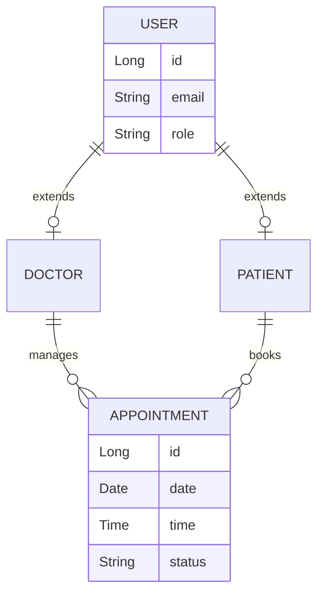

# 🏥 Enterprise Healthcare Appointment SaaS

<div align="center">
  <!-- IMPORTANT: Capture landing.png and place it in the /assets folder -->
  
</div>

<p align="center">
  <a href="#ci-cd"></a>
  <a href="#deployment"></a>
  <a href="#deployment"></a>
  <a href="https://spring.io/projects/spring-boot"></a>
  <a href="https://react.dev"></a>
  <a href="https://www.typescriptlang.org/"></a>
</p>

## 🚀 Live Demo & Links
- **Frontend URL**: `https://[Your-Vercel-App-Name].vercel.app`
- **Backend API**: `https://[Your-Render-App-Name].onrender.com`
- **Swagger Documentation**: `https://[Your-Render-App-Name].onrender.com/swagger-ui.html`
- **GitHub URL**: `https://github.com/[Your-GitHub-Username]/[Your-Repo]`

## 📖 Project Overview
A production-ready, N-Tier Healthcare Appointment Booking platform. This application connects patients with medical professionals through a highly secure, intuitive, and blisteringly fast Single Page Application (SPA). Engineered with **Clean Architecture**, stateless JWT authentication, and strict Web Vitals optimization, this project serves as a masterclass in modern Full-Stack development.

### ✨ Key Features
- **Role-Based Portals**: Distinct Dashboard and routing workflows for `DOCTOR` and `PATIENT` roles.
- **Smart Booking Wizard**: Multi-step, interactive appointment booking with Zod-enforced schema validation.
- **Stateless Authentication**: JWT architecture featuring dual Access/Refresh token rotation and Axios interceptors.
- **Aggressive Caching**: Sub-50ms data retrieval using TanStack Query, eliminating redundant network calls.
- **Immutable Databases**: Flyway SQL migrations ensure deterministic deployments.

## 📸 Screenshots

| Patient Dashboard | Doctor Dashboard | Booking Flow |
|:---:|:---:|:---:|
|  |  |  |

## 🛠 Tech Stack

### Frontend (React SPA)
- **Core**: React 19, TypeScript, Vite
- **UI/UX**: Material UI (MUI v7), Emotion, Responsive Grid
- **State**: TanStack Query (Server State), React Context (Auth State)
- **Forms**: React Hook Form + Zod
- **Optimization**: `React.lazy()` Code Splitting, Rollup `manualChunks`

### Backend (Spring Boot REST API)
- **Core**: Java 17, Spring Boot 3
- **Security**: Spring Security, BCrypt, JWT (JSON Web Tokens)
- **Data Persistence**: MySQL 8, Spring Data JPA (Hibernate)
- **Migrations**: Flyway
- **Documentation**: Springdoc OpenAPI (Swagger)

### DevOps & Infrastructure
- **CI/CD**: GitHub Actions
- **Containerization**: Docker (Multi-stage JRE Alpine)
- **Hosting**: Render (Backend) + Vercel (Frontend)

## 🏗 System Architecture



## 💻 Installation & Docker Setup

### Prerequisites
- Node.js 20+
- Java 17
- Docker & Docker Compose

### 1. Database & Backend Setup
Navigate to the backend directory and launch the MySQL container:
```bash
cd doctor-appointment-backend
docker-compose up -d
./mvnw spring-boot:run
```

### 2. Frontend Setup
Navigate to the frontend directory:
```bash
cd doctor-appointment-frontend
npm install
npm run dev
```

## ☁️ Deployment Guide

This project is strictly configured for deployment on Render and Vercel.

**Manual Backend Steps (Render):**
1. Connect your GitHub repository to a Render Web Service.
2. Ensure you add `SPRING_PROFILES_ACTIVE=prod` to your Environment Variables.
3. Configure your production PostgreSQL/MySQL Database URI via the Render dashboard.

**Manual Frontend Steps (Vercel):**
1. Connect your repository to Vercel.
2. In the deployment settings, add `VITE_API_URL` pointing to your Render URL.

## 📄 API Documentation
When the backend is running, the interactive OpenAPI specification is available at:
`http://localhost:8080/swagger-ui.html`

## 📁 Folder Structure
```text
frontend/
├── src/
│   ├── features/         # Feature-Sliced Design (auth, doctor, patient, appointment)
│   ├── components/       # Shared UI components
│   ├── context/          # Global Contexts (Theme, Auth)
│   └── routes/           # React Router DOM configuration
backend/
├── src/main/java/        # Clean Architecture (Controllers, Services, Repositories)
├── src/main/resources/   # application.yml and Flyway /db/migration scripts
```

## 🔄 CI/CD
The repository features a robust GitHub Actions pipeline (`backend-ci.yml`) that automatically runs Maven tests and verifies build integrity on every push to the `main` branch.

## 📜 License
Distributed under the MIT License.

## 👨‍💻 Author
**[Your Name]**
